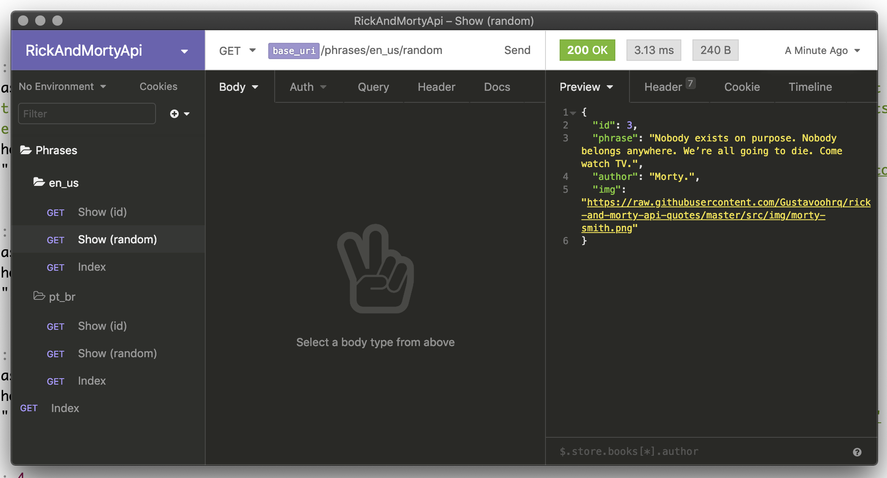

# Frases Rick e Morty / Rick and Morty's Quotes

Receba frases da série animada Rick e Morty por uma API. / Get Rick and Morty's quotes from API.

## Getting Started

Para acessar uma frase, use a url / Access the API using the url:</br>

```
https://rick-and-morty-api-phrases.herokuapp.com/
```

## Rest API Success Responses

- `GET /phrases/{language}`: Obter todas as frases / Get all phrases;
```json
[
  {
    "id": 1,
    "phrase": "xpto",
    "author": "xpto",
    "img": "http://"
  },
]
```

- `GET /phrases/{language}/{id}`: Obter frases por id / Get phrases by id;
```json
[
  {
    "id": 1,
    "phrase": "xpto",
    "author": "xpto",
    "img": "http://"
  },
]
```

- `GET /phrases/{language}/random`: Obter frases aleatórias / Get random phrases;
```json
[
  {
    "id": 1,
    "phrase": "xpto",
    "author": "xpto",
    "img": "http://"
  },
]
```

## Rest API Error Responses

- `GET /phrases/{param}/{param}`: 404
```json
  {
    "message": "The language does not exist"
  },
```

### Dependences
-   [Node.js](https://nodejs.org/en/)
-   [Nodemon](https://nodemon.io/)
-   [Express](https://expressjs.com/)
-   [Body-parser](https://www.npmjs.com/package/body-parser)
-   [Cors](https://www.npmjs.com/package/cors)
-   [Dotenv](https://www.npmjs.com/package/dotenv)

### Rest
-   [Insominia Rest](https://insomnia.rest/download/)
Na pasta **rest** é possível encontrar o arquivo de configuração do Insominia Rest, mas sinta-se a vontade para utilizar o que quiser. <br> In the folder **rest** you can find the Insominia Rest configuration file, but feel free to use whatever you want.

[](screens/rest_insomnia.png)


Para rodar localmente / To run locally:</br>

```
npm install
npm start
```

Sinta-se convidado para participar do desenvolvimento.</br>
Feel free to contribute.

## Authors

* **Gustavo Henrique** - [Gustavoohrq](https://github.com/Gustavoohrq)

## License

This project is licensed under the GNU GPL V3 - see the [LICENSE.md](LICENSE.md) file for details

